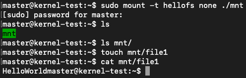

# hellofs

A local file system where the string HelloWorld is read every time the read system call is executed.

## Requirement

- Ubuntu == 10.04

## Build

```
$ make
```

## Install

```
$ sudo make install

```

## Demo

<div align="center">
	
</div>

